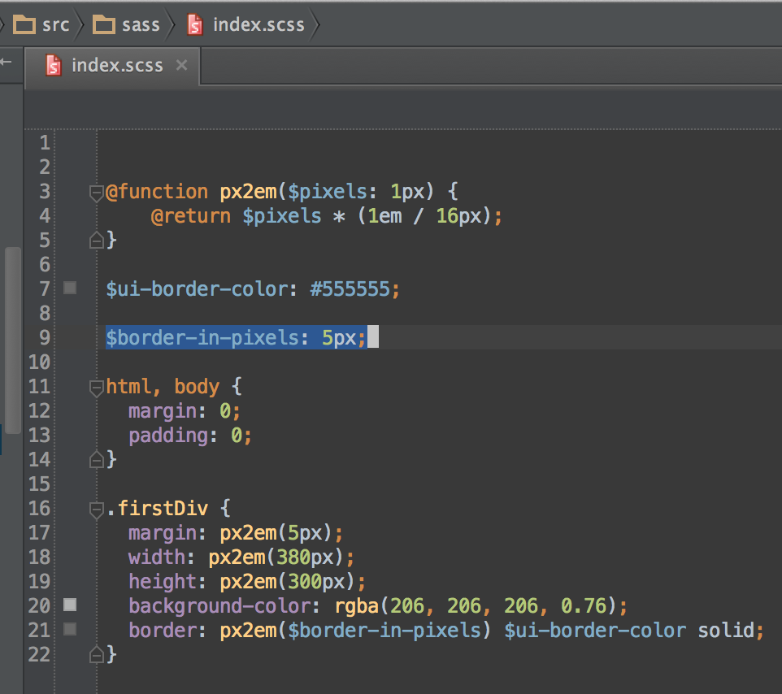
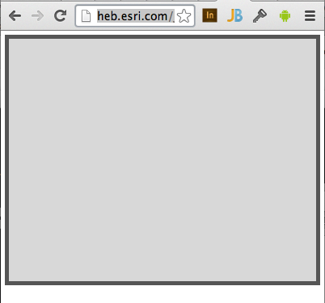
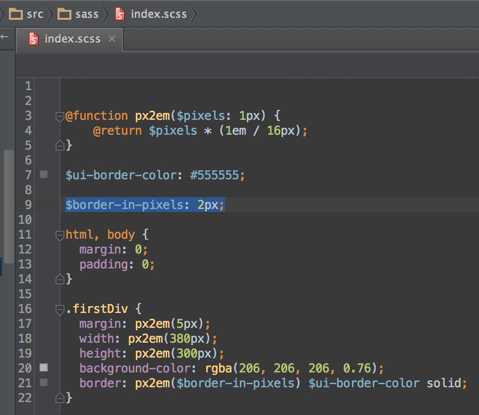
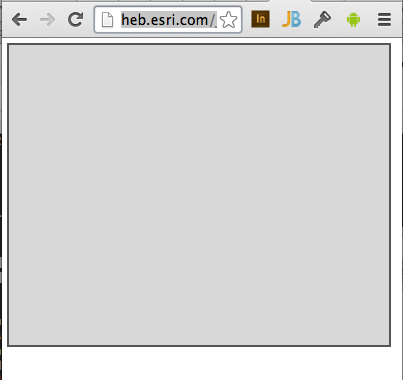

# hello-grunt-watch-livereload-scss

A simple starter sample showing how to use Grunt task runner, Compass/Sass to compile your stylesheets, and the Grunt watch plugin to live reload a web page when the stylesheet changes.

## Requirements

* Node.js
* Grunt
* Ruby
* Compass

### Quickstart

#### Install [Homebrew](http://brew.sh)

```  
ruby -e "$(curl -fsSL https://raw.github.com/Homebrew/homebrew/go/install)"
```

#### Install Ruby (latest)

```
brew install ruby
```

#### Install Git

```
brew install git
```

#### Install [Node.js](http://nodejs.org)

```
brew install node
```

#### Install [Grunt](http://gruntjs.com/getting-started)

```
npm install -g grunt-cli
```

#### Install [Compass](http://compass-style.org)

This installs Compass version: 0.12.6 and Sass version: 3.2.19

```
gem install compass
```

#### Check Compass version

```
heb:hello-compass-sass-grunt-scss$ compass --version
Compass 0.12.6 (Alnilam)
Copyright (c) 2008-2014 Chris Eppstein
Released under the MIT License.
Compass is charityware.
Please make a tax deductable donation for a worthy cause: http://umdf.org/compass
```

#### Clone the repo

```
git clone https://github.com/lheberlie/hello-grunt-watch-livereload-scss.git
```
### Open a terminal window at the repo (```hello-grunt-watch-livereload-scss```) location

```
heb:hello-grunt-watch-livereload-scss$ 
```

### Setup the ```dependencies```

```
npm install
```

### Update the ```index.html``` live reload script url

Open:

```
hello-grunt-watch-livereload-scss/build/index.html
```

Before:

```
<script src="//heb.esri.com:35729/livereload.js"></script>
```

After:

```
<script src="//yourWebServer:35729/livereload.js"></script>
```

#### Compile the scss file using the ```watch``` task

```
heb:hello-grunt-watch-livereload-scss$ grunt watch
Running "watch" task
Waiting...
>> File "src/sass/index.scss" changed.
Running "compass:dev" (compass) task
overwrite build/styles/index.css (0.016s)
Compilation took 0.021s

Done, without errors.


Execution Time (2014-06-06 16:53:56 UTC)
loading tasks  186ms  ▇▇▇▇▇▇▇▇▇▇▇▇▇▇▇▇▇▇▇▇▇▇▇▇▇▇▇▇▇▇▇▇▇▇▇▇▇▇▇▇▇▇▇▇▇▇▇▇▇▇▇▇▇▇▇▇▇▇▇▇▇▇▇▇▇▇▇▇ 35%
compass:dev    346ms  ▇▇▇▇▇▇▇▇▇▇▇▇▇▇▇▇▇▇▇▇▇▇▇▇▇▇▇▇▇▇▇▇▇▇▇▇▇▇▇▇▇▇▇▇▇▇▇▇▇▇▇▇▇▇▇▇▇▇▇▇▇▇▇▇▇▇▇▇▇▇▇▇▇▇▇▇▇▇▇▇▇▇▇▇▇▇▇▇▇▇▇▇▇▇▇▇▇▇▇▇▇▇▇▇▇▇▇▇▇▇▇▇▇▇▇▇▇▇▇▇▇▇▇▇▇▇▇ 65%
Total 532ms

Completed in 0.778s at Fri Jun 06 2014 11:53:56 GMT-0500 (CDT) - Waiting...
>> File "build/styles/index.css" changed.
Completed in 0.000s at Fri Jun 06 2014 11:53:56 GMT-0500 (CDT) - Waiting...
>> File "src/sass/index.scss" changed.
Running "compass:dev" (compass) task
overwrite build/styles/index.css (0.017s)
Compilation took 0.019s

Done, without errors.


Execution Time (2014-06-06 16:54:07 UTC)
loading tasks  190ms  ▇▇▇▇▇▇▇▇▇▇▇▇▇▇▇▇▇▇▇▇▇▇▇▇▇▇▇▇▇▇▇▇▇▇▇▇▇▇▇▇▇▇▇▇▇▇▇▇▇▇▇▇▇▇▇▇▇▇▇▇▇▇▇▇▇▇▇▇▇▇▇▇▇▇▇▇ 39%
compass:dev    298ms  ▇▇▇▇▇▇▇▇▇▇▇▇▇▇▇▇▇▇▇▇▇▇▇▇▇▇▇▇▇▇▇▇▇▇▇▇▇▇▇▇▇▇▇▇▇▇▇▇▇▇▇▇▇▇▇▇▇▇▇▇▇▇▇▇▇▇▇▇▇▇▇▇▇▇▇▇▇▇▇▇▇▇▇▇▇▇▇▇▇▇▇▇▇▇▇▇▇▇▇▇▇▇▇▇▇▇▇▇▇▇▇▇▇▇▇▇▇▇▇ 61%
Total 489ms

Completed in 0.726s at Fri Jun 06 2014 11:54:07 GMT-0500 (CDT) - Waiting...
>> File "build/styles/index.css" changed.
Completed in 0.000s at Fri Jun 06 2014 11:54:08 GMT-0500 (CDT) - Waiting...
```

#### Open the app in a browser window

Example: 

```
http://heb.esri.com/hello-grunt-watch-livereload-scss/build/
```

#### Witness live reload in action

Open ```index.scss```:

```hello-grunt-watch-livereload-scss/src/sass/index.scss```

Modify the value of ```$border-in-pixels```:

Before:

```$border-in-pixels: 5px;```





After:

```$border-in-pixels: 2px;```





#### Summary

The watch task should compile the stylesheet, and livereload should push the changes (```index.css```) to your browser window.  Your workflow just got better! 

## Licensing
Copyright 2014 Lloyd Heberlie

Licensed under the Apache License, Version 2.0 (the "License");
you may not use this file except in compliance with the License.
You may obtain a copy of the License at

   http://www.apache.org/licenses/LICENSE-2.0

Unless required by applicable law or agreed to in writing, software
distributed under the License is distributed on an "AS IS" BASIS,
WITHOUT WARRANTIES OR CONDITIONS OF ANY KIND, either express or implied.
See the License for the specific language governing permissions and
limitations under the License.

A copy of the license is available in the repository's [license.txt](license.txt) file.
